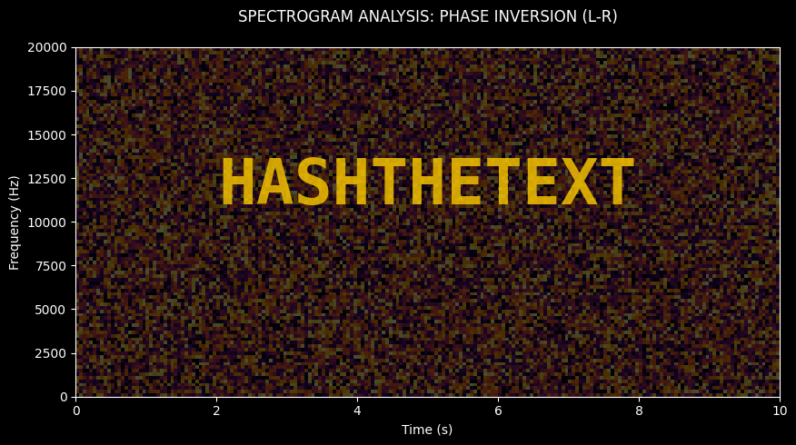

# GSMG.IO 5 BTC Puzzle Hints

This repository contains all publicly known hints and partial solutions for the **GSMG.IO 5 BTC puzzle challenge**. Contributions and further decoding are highly welcome!

> **Support:** If you find this useful, please consider donating BTC to: [`1JK27jtvE1wS4VG9k7Zpo8wBufMbYwy3r8`](https://www.blockchain.com/btc/address/1JK27jtvE1wS4VG9k7Zpo8wBufMbYwy3r8)


## Table of Contents
- [Summary](#summary)
- [Tools](#tools)
- [Walkthrough](#walkthrough)
  - [Phase 1: The Binary Matrix](#phase-1-the-binary-matrix)
  - [Phase 2: The Seed is Planted](#phase-2-the-seed-is-planted)
  - [Phase 3: Choice is an Illusion](#phase-3-choice-is-an-illusion)
    - [Phase 3.1: Passwords Assembly](#phase-31-passwords-assembly)
    - [Phase 3.2: The Merovingian](#phase-32-the-merovingian)
    - [Phase 3.2.1: Beaufort Cipher](#phase-321-beaufort-cipher)
    - [Phase 3.2.2: VIC Cipher](#phase-322-vic-cipher)
- [Additional Hints](#additional-hints)
  - [Decentraland Audio Hint](#decentraland-audio-hint)
  - [Poem from the Creator](#poem-from-the-creator)
- [Salphaseion and Cosmic Duality](#salphaseion-and-cosmic-duality)
  - [Decoding Salphaseion](#decoding-salphaseion)
- [ECDSA Signatures from the Puzzle Address](#ecdsa-signatures-from-the-puzzle-address)

---

## Summary
- The puzzle was originally published at [https://gsmg.io/puzzle](https://gsmg.io/puzzle).
- The prize address holding the 5 BTC is [`1GSMG1JC9wtdSwfwApgj2xcmJPAwx7prBe`](https://www.blockchain.com/btc/address/1GSMG1JC9wtdSwfwApgj2xcmJPAwx7prBe).
  - *Note:* The creator intended to halve the prize each time a Bitcoin halving occurs. The first halving during the puzzle was on May 11, 2020. The intended value is mathematically 2.5 BTC right now.
- **Discussions on Reddit:** 
  - [gsmgio_5_btc_puzzle](https://www.reddit.com/r/bitcoinpuzzles/comments/dfwcqk/gsmgio_5_btc_puzzle/)
  - [gsmgio_5_btc_puzzle_challenge](https://www.reddit.com/r/bitcoinpuzzles/comments/bf7siz/gsmgio_5_btc_puzzle_challenge/)

---

## Tools
- **SHA256 Online Tool**: [XORBIN](https://xorbin.com/tools/sha256-hash-calculator)
- **AES Decryption**: Secure text elements are typically encrypted using OpenSSL's AES cipher. Use [OpenSSL](https://www.openssl.org/).

**Useful OpenSSL command structure:**
```bash
openssl enc -aes-256-cbc -d -a -in <filename> -out <output_filename>
```
*Useful OpenSSL flags:*
- `-d`: decrypts data
- `-a`: tells OpenSSL that the encrypted data is in base64
- `-in <filename>`: specifies the file to decrypt
- `-out <filename>`: specifies the file to put the decrypted data in

---

## Walkthrough

### Phase 1: The Binary Matrix
**URL:** `https://gsmg.io/puzzle`

The initial image contains squares which represent bits. 
- **Black/Blue** = `1`
- **Yellow/White** = `0`

It forms a 14x14 binary matrix:
```text
0 0 1 1 0 1 0 0 1 0 1 1 0 0
1 1 1 1 0 0 1 1 1 0 1 0 1 1
1 1 0 1 1 1 0 1 0 0 1 0 0 1
0 1 1 0 1 0 0 0 0 1 1 1 0 1
0 1 1 0 0 0 1 1 0 0 0 1 1 0
1 0 0 1 1 0 0 0 1 0 0 0 1 1
1 0 0 1 1 1 0 0 0 1 0 0 0 0
1 1 1 0 0 0 0 0 0 0 1 0 0 0
0 0 0 1 1 1 0 1 1 1 1 1 0 1
1 1 1 1 1 1 0 0 1 1 0 0 0 1
1 1 0 1 0 0 0 0 0 1 1 0 1 1
1 1 1 1 0 0 1 0 1 0 1 1 0 0
0 1 0 1 1 1 0 1 0 0 0 1 1 0
0 1 1 0 1 1 0 1 1 0 1 0 1 1
```

Start from the upper-left square and read **counterclockwise in a spiral**. Convert the 8-bit groups to ASCII characters:
```text
01100111 (103 g)
01110011 (115 s)
01101101 (109 m)
01100111 (103 g)
00101110 (46 .)
01101001 (105 i)
01101111 (111 o)
00101111 (47 /)
01110100 (116 t)
01101000 (104 h)
01100101 (101 e)
01110011 (115 s)
01100101 (101 e)
01100101 (101 e)
01100100 (100 d)
01101001 (105 i)
01110011 (115 s)
01110000 (112 p)
01101100 (108 l)
01100001 (97 a)
01101110 (110 n)
01110100 (116 t)
01100101 (101 e)
01100100 (100 d)
```

**Resulting string:** `gsmg.io/theseedisplanted`

---

### Phase 2: The Seed is Planted
**URL:** `https://gsmg.io/theseedisplanted`


The pictures refer to the song **The Warning (by Logic)**. You can decipher this by rearranging the images: `war` + `ning` and `LO` + (crypto) `gic`.

**Lyrics:**
> **intro**
> The warning
> 
> **verse**
> Phase one
> The seed is planted when opposites attract
> Can you dig it?
> It takes the physical to create the physical
> 
> Phase two
> The flower blossoms through what seems to be a concrete surface
> i.e. greed, racism, insanity, physical and social handicaps
> These are the things that mob the flower
> Red rose or black rose; no in-between
> 
> Phase 3
> The Judgement
> If it were to fall upon you today, which flower would you be?
> The red rose or the black?
> 
> **outro**
> This is the warning

This webpage also contains a hidden `POST` form accessible via your browser's Developer Tools (F12 in Chrome).
1. Unhide it.
2. Enter the password: `theflowerblossomsthroughwhatseemstobeaconcretesurface`
3. Hit the **Submit** button to be redirected to the next step.

---

### Phase 3: Choice is an Illusion
**URL:** `https://gsmg.io/choiceisanillusioncreatedbetweenthosewithpowerandthosewithoutaveryspecialdessertiwroteitmyself`


This phase's title references a quote from *The Matrix Reloaded*:
> **Merovingian:** You see, there is only one constant one universal: ***causality*** - cause and effect.
> **Morpheus:** Everything begins with choice.
> **Merovingian:** No. Wrong. ***Choice is an illusion created between those with power and those without***.

The primary password for this step's payload is `causality`.
Hashing it yields the decryption key:
`SHA256(causality) = eb3efb5151e6255994711fe8f2264427ceeebf88109e1d7fad5b0a8b6d07e5bf`

Decrypt the provided text (`phase2.txt`) in your terminal:
```bash
openssl enc -aes-256-cbc -d -a -in phase2.txt -pass pass:eb3efb5151e6255994711fe8f2264427ceeebf88109e1d7fad5b0a8b6d07e5bf
```

**Decryption Result:**
```text
The ironic 2name of the keymakers trying to protect the current digital powers which are still in severe danger due to the keymaker's way of security by hiding, nearly unprotected, in plain sight. {eps3.4_[in one of the valleys of Phillip]runtime-error.r00., where daughters hit magic keypads} When this fails.. Crypto finally to the latin 3Moon? Tell me, 4How so mate?
# X 2 S H 4 Y 0 Q B 15 #
Q -> extend the name of a hackers' swordless fish, the I and W are below.
B -> ((BV80605001911AP)- (sqrt(-1)))^2
H -> (Answer to only this puzzle but nothing else) * -1
S -> cha' + (vagh * jav)
Ok kid, on the highway, let put it in the worst gear.
```

*(Note: It is somewhat unclear how all equations relate, but researchers noted that `S` equals Klingon numbers `2+(5*6)=32` and `BV80605001911AP` is an Intel i5 processor model, evaluating `B` to `(5i-i)^2 = 16i^2 = -16`.)*

#### Phase 3.1: Passwords Assembly
Using the other hints (2name, 3Moon, 4How so mate) which refer to a [Thales Hardware Security Module](https://thalesdocs.com/gphsm/luna/10.1/docs/network/Content/Product_Overview/the_safenet_hsm/the_safenet_hsm.htm), you must assemble a massive, 7-part password.

**The Parts:**
1. `causality` - Established in the beginning.
2. `Safenet` - From "2name" reference.
3. `Luna` - From "3Moon" reference.
4. `HSM` - Hardware Security Module ("4How so mate").
5. `11110` - A reference to John F. Kennedy's Executive Order 11110 ("A ruler with a number... 5binary code" trying to rein in the Federal Reserve). 
6. `0x736B6E616220726F662074756F6C69616220646E6F63657320666F206B6E697262206E6F20726F6C6C65636E61684320393030322F6E614A2F33302073656D695420656854` - "raw data after 4 on row 1616" points to the genesis block in the [source code to Bitcoin itself](https://sourceforge.net/p/bitcoin/code/133/tree/trunk/main.cpp#l1616). (And `"/(aBa, connected enf)"` means keep casing and remove whitespace).
7. `B5KR/1r5B/2R5/2b1p1p1/2P1k1P1/1p2P2p/1P2P2P/3N1N2 b - - 0 1` - "A buddhist is forced to move...": A chess position reference after a move that avoids a checkmate. (`"/(aBa, connected not enf)"` means keep whitespace).

**Concatenate all 7 parts exactly and take the SHA256 hash:**
```text
SHA256(causalitySafenetLunaHSM111100x736B6E616220726F662074756F6C69616220646E6F63657320666F206B6E697262206E6F20726F6C6C65636E61684320393030322F6E614A2F33302073656D695420656854B5KR/1r5B/2R5/2b1p1p1/2P1k1P1/1p2P2p/1P2P2P/3N1N2 b - - 0 1)
= 1a57c572caf3cf722e41f5f9cf99ffacff06728a43032dd44c481c77d2ec30d5
```

This hash acts as the key to decrypt `phase3.txt`:
```bash
openssl enc -aes-256-cbc -d -a -in phase3.txt -pass pass:1a57c572caf3cf722e41f5f9cf99ffacff06728a43032dd44c481c77d2ec30d5
```

**Decryption Result of `phase3.txt`:**
```text
What if the merovingian is wrong. What instead of causality something else could be ours? Therefor, if so, the ...... is ours. The thinker's 1name behind all of that would grant you access to the next step (of humanity). Definitely look into his works might you have time. /(aa,connected enf)

I just passed a cheshire cat and I'm getting fed up with this puzzle.. It's taking forever. But, How long is forever? I don't know, but just add giveit in front of the answer and you can fall in the keyhole. /(aa,connected enf)

3.The fundamental limit to the precision with which certain pairs of physical properties are know. /(aa,connected enf)

Phase 3.2 is ciphered with aes-256-cbc base64 and a sha256 pw, yet again.
U2FsdGVkX1/u/Exb78Fl...
```

#### Phase 3.2: The Merovingian
Assemble the next password from the hints in the decrypted text above:
1. "The thinker's 1name behind all of that..." -> Jacque Fresco ("The future is fluid... The future is ours to direct.") -> **`jacquefresco`**
2. "I just passed a cheshire cat... How long is forever? add giveit in front..." -> Alice in Wonderland quote: "Sometimes, just one second" -> **`giveitjustonesecond`**
3. "3.The fundamental limit to the precision..." -> **`heisenbergsuncertaintyprinciple`**

Combine these into the next password string:
`jacquefrescogiveitjustonesecondheisenbergsuncertaintyprinciple`

Its SHA256 hash is:
`250f37726d6862939f723edc4f993fde9d33c6004aab4f2203d9ee489d61ce4c`

Decrypt `phase3.2.txt` (the Base64 payload from `phase3.txt`) using this hash:
```bash
openssl enc -aes-256-cbc -d -a -in phase3.2.txt -pass pass:250f37726d6862939f723edc4f993fde9d33c6004aab4f2203d9ee489d61ce4c
```

**Decrypted Text (`phase3.2.txt`):**
```
I've been waiting for you. You have many questions, and although the process has altered your consciousness, you remain irrevocably human. Ergo, some of my answers you will understand, and some of them you will not. Concordantly, while your first question may be the most pertinent, you may or may not realize it is also irrelevant.

... am I here? Wake up, you... I've designed you a beautiful strategic position. One for one, four for one.

╬╚,╬°%_┴°°╟%═╧/╟╚:_Ў°├╤°═╠?╟/°╚═,::╚┼╤,├╧°═`/╚?╧`>%┴┬╚╔╧├├╬┼///╠Ў├%╩╠╬?,%╤┼??╠┴╤┴╠Ў`╧╧═,══[└%├╧°╧┴,?┼╦>┼┬╬╚:_>╚┴═%╟°═[╟_╩/┬╤╤┴Ў°╚╬[/╔┬╦°╔/═╟°_└Ў╔╟/╔╟═`└└╤╧┼╠╬╠┼°?├/╔╤:╦┴>╚`┴╦╔_┼[╟═/:_`╟_>╩┬:╤?`╟═[╬╔:[├_╧╠?╚?_?┬%├┴┬%[>┼°°╦┴%╦>%╧/┴╟[>╧╠:>/`>/[┴/:╟├:┴═>°┴┴╧Ў╬╟Ў`╦╔Ў°°?╦/%/┬:═/°%°°°╚┴/├╬╬>:°╩`╟╦>,Ў═╠╦_,═┬>>╤_?°═,?Ў┴>╦>%├╠├/┬┼┴═Ў_`╔┬╔╧╚>_:╤╚┬╚╔╧═,═╧├>╠_├°┴°╠═╤╧═╠╔╔╬┼╧┼°:°°╚>┼═`/%?/╬╦>,°°═╟?╟,[/:╩┼╟_╩°┬╟╤[┴┼╦Ў└>╚╚╚┴°╔└_:╩,└┬╦╚╤/┬>/╦Ў_`╚┼╟╔╟╤_[/└┼Ў╬%╟═╬╔///┬/┬`╚╠╔╟┴╚╬>°╦,>┬╤>°╠╠╧:╩,├[:Ў_╟°╟┴:Ў_`└,╔╚╔╩╤╠%`╟└?%╟═?[°?┴[╧/,/├?_%═?└/?╠_╟╠,╤┴╟┴,┼,╤╚═┴%_`>┬°═╟?╬?┬%°╤`Ў/,┬└═╠┬═%°├>>╚[├_°╔└╦├└,[/╬/:╟/,╤┴°┴%`╬/┬┬,?╤╚`[├╬═╦╟,┬[Ў╧:═/└╤╬├_┼Ў└_┬/╧:╟_>┴,┴%╟═?[°`,═╟_>╠╤>╤╩┴┼Ў╔:%┴>┬`┴╠┴_>°═[/%┴┴╤/Ў╬╩Ў_`╟└_?└%┴?°╔,╔>>:╔┬??╚>╔_[`┬_└╤/Ў╠_╩└__>╔`┬┼╚%%╔,[╤:═╤╟_Ў╔°╬╤┴╟╠╧/╚%╤°╤╚═└?╚╦├╔┼:_/,_╟>°╔:╤>`╠╚:?┼`┼╤┼╬╚_╧┬╚┼╟%°╠╚╚°┼╤├?╟╦┼┴_°,°╤`/╚═└?_/`╔╚:╧╚═╚%`_╚╧°°═┬_╚╧╧═╟_>╧Ў°╟└╟,╩%├%_:╤>═╦╟°╟╩═╤╚═>╤╤┴└╬├└╤╩┴╬└°°%_╤┬╠╩╚┴╟%╔╧`%╧╚:_/╔┴┴/╧╟`╧┬/:╦╤╦_╩>╚┴╧/├╠┼╬└┬_Ў°:°_└╤/┼//╤╟╩Ў╦_╩>╚┼╧╔,[╔°,[╤╧╔Ў╬╩╧[?╚Ў_╩:/:╟╚`/┴?╚?╚═╟╩?╧`>├_°╔└[┴┴┼[┼╚╤╚_[>°└╔>:,╬>°°╔╦Ў╩>┼Ў┴╧/`└Ў├%╧:═╚`┴%╦_┬`╠╧╔:_═╧╟Ў╬╠?╦┴%/°///,_╔>,Ў>╚┴Ў,°:╧╚?`╚/╩:╔╧,%╧╔[?╧:═/,┴╤╔╦┼═>═┬:[═/?`┴┼%╚,╧╟╧├>╤┴°╤╔┴┼└,`╔╠╔╔?╔═╧╤>┼┴[Ў┴_/:°╔%╔╧┼`,┴/Ў?═__┴//╬╤┬Ў%┴└╧├═┬╦[Ў°╚╦├┴╔╠═╠┴╟╧╔`└╩┴>/>╩┴%╦├═%├╚°_╔_[?╔┴╚╬,%%┬_└┴,╟:╩╠╤╔╦╠`╬╔Ў└┼:_/>°╔╟╟╦>╧┼╦╔,╚╧?└╩╬:>__┼?_?└╤Ў°┬?°╔╧°╚?_╤>>╤╟├°═%╦°═[┼┬_?╠┴╤┴/═╬└╤/[┼Ў╤╔/═┼╤`/,╟`╦├?╦╤Ў_/╦╩:,├?╧┼╧╠═┬/═┴°╤Ў╬╩Ў_`╟╦_╤╧°`┴°/_╔:`%╧//┴╧/Ў┴%`┬┴/╧?┬╬╔[╬╧://Ў═,╚╬═,═└╠:╚┬╟├┼/[└/├╬╦_╤╧,┬╟%├╤┴└°═╟,[:╧%┴>/,┴╚,╟,%_┬%╚╩`╬/,┴╚═╟,╟,╟°°_`╬╬└?┼°╧╟╚╧╔╤[``_╔┼?╬╠>?└,└///┬╧┬:/┼└/╟>╔>├╦/?_:/┴┴/╧┴%,╦%╟╔%╧╤┼╤Ў

15165943121972409169171213758951813141543131412428154191312181219433121171617137149110916631213131281491109166131412199114371612126021664313711154112

Raising the stakes without extra chances of winning. A fubcd-king & oracle-queen, thingky mvps, on a sad board but as wide as the first one seen.

U2FsdGVkX1+0Wl49gnWTyiimluu7V3+vl7st0gUt9sWDzNLxDmlPMsDSiuW2a46z
gKlIi8aaqY5gpJPPEzW1n9n3/26qs4zstWtPKF8Zs/BTNN4IiEh4qu18mdC0NAv4
```

#### Phase 3.2.1: Beaufort Cipher
In the decrypted text, clues:
- "... am I here? Wake up, you..." -> From *The Matrix*: "The matrix has you" (replacing neo with you). So the key is **`THEMATRIXHASYOU`**.
- "beautiful strategic position" -> **Beaufort cipher**.
- "one for one, four for one" -> 1141 -> **IBM EBCDIC 1141** encoding.

The symbol blob (Block 1) translated via EBCDIC 1141 yields a sequence of letters: 
`vtkvplmepphluw... (snip)`

Go to a cipher tool like [CipherTools](https://ciphertools.co.uk/decode.php), paste the string, select **Beaufort**, and use the key **THEMATRIXHASYOU**. The translated message resembles The Architect from *The Matrix*:

  YOUR LIFE IS THE SUM OF A REMAINDER OF AN UNBALANCED EQUATION INHERENT TO THE PROGRAMMING OF THIS PUZZLE 
  YOU ARE THE EVENTUALITY OF AN ANOMALY WHICH DESPITE MY SINCEREST EFFORTS I HAVE BEEN UNABLE TO ELIMINATE 
  FROM WHAT IS OTHERWISE A HARMONY OF MATHEMATICAL PRECISION WHILE IT REMAINS A BURDEN TO SEDULOUSLY AVOID IT 
  IT IS NOT UNEXPECTED AND THUS NOT BEYOND A MEASURE OF CONTROL WHICH HAS LED YOU INEXORABLY HERE YOU 
  YOU HAVEN'T ANSWERED MY QUESTION ME QUITE RIGHT INTERESTING THAT WAS QUICKER THAN THE OTHERS PLEASE IF YOU 
  FIND A WAY TO COMPLETE THE LAST PART OF THE PUZZLE TAKE THE PRIVATE KEY YOUVE EARNED IT BUT PLEASE TAKE 
  THIS TO HEART THAT WHAT A WISEMAN ABOVE HINTED AT IS WORTH HUNDRED FOURTY OF THE INVESTMENT THAT'S 
  WHAT US GUYS AT GSMG ARE TRYING TO ACCOMPLISH IN THE END PLEASE JUST HELP US BUILD IT INSTEAD OF JUST 
  WAISTING YOUR LIFETIME BY HUNTING FOR WORTHLESS PRICES AND THROPHIES LIKE THIS I'M SORRY TO 
  TELL YOU THAT YOUVE COME THIS FAR BUT YOU'LL NEVER FINISH THE LAST TASK I EXPECT YOU TO SAY BULLSHIT 
  WELL DENIAL IS THE MOST PREDICTABLE OF ALL HUMAN RESPONSES BUT REST ASSURED THIS WILL NOT BE THE LAST TIME 
  I HAVE DESTROYED A RESTLESS SOUL AND I HAVE BECOME EXCEEDINGLY EFFICIENT AT IT THE FUNCTION OF THE YOU IS 
  NOW TO RETURN TO THE SOURCE CODES ALLOWING A TEMPORARY DISSEMINATION OF THE CODE YOU HOPEFULLY CARRY 
  REINSERTING THE PRIME BASICS AFTER WHICH YOU WILL BE REQUIRED TO SELECT FROM OVER TWENTY-THREE CIPHERS 
  SIXTEEN ENCRYPTIONS AND OR SEVEN INTERTWINED PASSWORDS TO FIND THE ACTUAL PRIVATE KEYNOTE THAT ALSO 
  BRUTE FORCING MIGHT BE REQUIRED FAILURE TO COMPLY WITH THIS PROCESS WILL RESULT IN A CATACLYSMIC 
  SYSTEM CRASH KILLING YOUR WILLPOWER WHICH COUPLED WITH THE EXTERMINATION OF YOUR WILL TO LIVE AND WILL 
  ULTIMATELY RESULT IN THE EXTINCTION OF THE ENTIRENESS OF YOURSELF SELF GOOD LUCK NEVERTHELESS I REALLY
  HOPE YOURE THE ONE CIAO BELLA O

#### Phase 3.2.2: VIC Cipher
The number string:
`15165943121972409169171213758951813141543131412428154191312181219433121171617137149110916631213131281491109166131412199114371612126021664313711154112`
Clues sentence: "A fubcd-king & oracle-queen, thingky mvps, on a sad board but as wide as the first one seen."

This references the **VIC Cipher**.
- Removing repeating characters: `FUBCD ORA.LE THINGKY MVPS`
- Appending the remaining letters: `FUBCDORA.LETHINGKYMVPS/JQZXW`

Using a [VIC Cipher Decoder](https://www.dcode.fr/vic-cipher):
- **Alphabet:** `FUBCDORA.LETHINGKYMVPS.JQZXW`
- **Digit 1:** `1`
- **Digit 2:** `4`
- **Input code:** `1516594...`

**Result:**
> `IN CASE YOU MANAGE TO CRACK THIS THE PRIVATE KEYS BELONG TO HALF AND BETTER HALF AND THEY ALSO NEED FUNDS TO LIVE`

---

## Additional Hints

### Decentraland Audio Hint


There is a hint from the puzzle creator in Decentraland. By going to the coordinates shown, you trigger an audio file.
**Solution:** Split the stereo track, invert one side, mix them back, convert to mono, and generate a spectrogram. The visual wave output reads: **`HASHTHETEXT`**



---

## Salphaseion and Cosmic Duality

Go to the very first puzzle base page (`https://gsmg.io/puzzle`) and run SHA256 on the primary textual content:

`SHA256(`GSMGIO5BTCPUZZLECHALLENGE1GSMG1JC9wtdSwfwApgj2xcmJPAwx7prBe`) = 89727c598b9cd1cf8873f27cb7057f050645ddb6a7a157a110239ac0152f6a32`

This hash leads to a hidden endpoint:
`https://gsmg.io/89727c598b9cd1cf8873f27cb7057f050645ddb6a7a157a110239ac0152f6a32`


This hidden phase can be split into multiple sections. Currently, only some have been partially decoded. There are a series of letters intermingled with `z` markers, a long binary-like string containing `abba`, and an AES blob:

    d b b i b f b h c c b e g b i h a b e b e i h b e g g e g e b e b b g e h h e b h h f b a b f d h b e f f c d b b f c c c g b f b e e g g e c b e d c i b f b f f g i g b e e e a b e a b b a b b a b a b b a a a a b a b b b a b a a a b b b a a b a a b b a b a a b a b b b b a a a a b b b a a b b a b b b a b a b a b b a b b a b a b b a b b a a a b b a b a a b a b b b a a b b a b b b a b a a f a e d g g e e d f c b d a b h h g g c a d c f e d d g f d g b g i g a a e d g g i a f a e c g h g g c d a i h e h a h b a h i g c e i f g b f g e f g a i f a b i f a g a e g e a c g b b e a g f g g e e g g a f b a c g f c d b e i f f a a f c i d a h g d e e f g h h c g g a e g d e b h h e g e g h c e g a d f b d i a g e f c i c g g i f d c g a a g g f b i g a i c f b h e c a e c b c e i a i c e b g b g i e c d e g g f g e g a e d g g f i i c i i i f i f h g g c g f g d c d g g e f c b e e i g e f i b g i b g g g h h f b c g i f d e h e d f d a g i c d b h i c g a i e d a e h a h g h h c i h d g h f h b i i c e c b i i c h i h i i i g i d d g e h h d f d c h c b a f g f b h a h e a g e g e c a f e h g c f g g g g c a g f h h g h b a i h i d i e h h f d e g g d g c i h g g g g g h a d a h i g i g b g e c g e d f c d g g a c c d e h i i c i g f b f f h g g a e i d b b e i b b e i i f d g f d h i e e e i e e e c i f d g d a h d i g g f h e g f i a f f i g g b c b c e h c e a b f b e d b i i b f b f d e d e e h g i g f a a i g g a g b e i i c h i e d i f b e h g b c c a h h b i i b i b b i b d c b a h a i d h f a h i i h i c z a g d a f a o a h e i e c g g c h g i c b b h c g b e h c f c o a b i c f d h h c d b b c a g b d a i o b b g b e a d e d d e z c f o b f d h g d o b d g o o i i g d o c d a o o f i d h z s h a b e f o u r f i r s t h i n t i s y o u r l a s t c o m m a n d U 2 F s d G V k X 1 8 6 t Y U 0 h V J B X X U n B U O 7 C 0 + X 4 K U W n W k C v o Z S x b R D 3 w N s G W V H e f v d r d 9 z a b b a a b a b a b b a b b b a a b b b a b a a a b b a a b a b a b b b a a b a Q v X 0 t 8 v 3 j P B 4 o k p s p x e b R i 6 s E 1 B M l 5 H I 8 R k u + K e j U q T v d W O X 6 n Q j S p e p X w G u N / j J s h a b e f a n s t o o

### Decoding Salphaseion

The two highlighted `abba` sections can be decoded first. Treat **`a = 0`** and **`b = 1`**, and interpret the resulting strings as 8-bit binary representation of ASCII characters:

1. `a b b a b b a b a b b a a a a b a b b b a b a a a b b b a a b a a b b a b a a b a b b b b a a a a b b b a a b b a b b b a b a b a b b a b b a b a b b a b b a a a b b a b a a b a b b b a a b b a b b b a b a a` -> **`matrixsumlist`**
2. `a b b a a b a b a b b a b b b a a b b b a b a a a b b a a b a b a b b b a a b a` -> **`enter`**

**The "shabef" Encoding:**
We see the sequence `shabef` directly before English text `"our first hint is your last command"`.
In previous steps, the first command was `sha256`. Therefore, we infer a mapping:
`s=s, h=h, a=a, b=2, e=5, f=6` -> Meaning it maps purely to its alphabetical position (`a=1, b=2 ... z=26`) representing `sha256`.

The letter `z` seems to act as a separator to segment the character blocks:
- **Block 1:** `a g d a f a o a h e i e c g g c h g i c b b h c g b e h c f c o a b i c f d h h c d b b c a g b d a i o b b g b e a d e d d e`
- **Block 2:** `c f o b f d h g d o b d g o o i i g d o c d a o o f i d h`

Since letters only range from `a-i` and `o`, we translate `a-i` to `1-9` and `o` to `0`:
1. `174161018595377387932283725836301293648834223172419022725145445`
2. `36026487402470099740341006948`

Treating these sequences as Base-16 integers provides corresponding hex strings, which map to ASCII text:
1. Translates to: **`lastwordsbeforearchichoice`**
2. Translates to: **`thispassword`**

anstoo = 1-14-19-20-15-15
*(Further steps to decrypt the remaining AES blob in Salphaseion with these passwords are ongoing...)*

### Poem from the Creator
```text
Roses are White but often Red.
Yellow has a number and so does Blue.
Go back to the first puzzle piece without further ado.

It might have shown you only one door, beware that the rabbits nest may contain a whole lot more.

Hush hush.
```

---

## ECDSA Signatures from the Puzzle Address

The following are the ECDSA signature components extracted from spending transactions of the puzzle address `1GSMG1JC9wtdSwfwApgj2xcmJPAwx7prBe`. All inputs share the same uncompressed public key.

**Public Key (all inputs):**
```
04f4d1bbd91e65e2a019566a17574e97dae908b784b388891848007e4f55d5a46
49c73d25fc5ed8fd7227cab0be4e576c0c6404db5aa546286563e4be12bf33559
```

Each signature consists of:
- **R**, **S** — the two components of the ECDSA signature
- **Z** — the transaction sighash (the message that was signed)
- **sighash_type** — `1` = `SIGHASH_ALL`

---

### Transaction 1
[`2aa9a4a90be819d5122d70c993280785a0508f163521e7b38cebb4db0b071b13`](https://www.blockchain.com/es/explorer/transactions/btc/2aa9a4a90be819d5122d70c993280785a0508f163521e7b38cebb4db0b071b13)

| vin | R | S | Z |
|-----|---|---|---|
| 0 | `dbe31ca9440892abcec35c0aa83380e1c35d2a33ea99fc314e6bcaf299b8847a` | `17a2531912ce634185f572357b49873764545d8703723002d3c3778e763e98dc` | `3596e7108347b041e49483c08d94f516ec16383a7a0d18d9cfef100988bfd680` |
| 1 | `fce22a0a026a33197ae65efa47420aa1c4efdbf95f8370f4da22802392ab2db2` | `193bbf54a6be9ef136eefee1dd17006e4d75558f7a26982c266825de2bae9bbe` | `9ecb8572ff38c8e3920c0448193be179b780c02b4324c8e787c7f7f44d1f8590` |
| 2 | `776706ca3039c2e127aff3f144333e9afc6c4dcf5ba2dd9243268324622d65f6` | `2dae7fda100bf3567d813790ccb1837481a2852d3f74678120e0cd094fda0b96` | `f481edd08f280642d81ed4dc6ce6954ceea7b58b7cfc1be5b7e100c2d02b9c93` |

---

### Transaction 2
[`88cdb3cdca12b471551b1b26188508a14ca5fd8a415223ffb7c190381c9b9df3`](https://www.blockchain.com/es/explorer/transactions/btc/88cdb3cdca12b471551b1b26188508a14ca5fd8a415223ffb7c190381c9b9df3)

| vin | R | S | Z |
|-----|---|---|---|
| 0 | `1df5cf8403c9309aba324ef94a43551a32a258326009abb4ac1153c06de327d0` | `1640b665814359b3eae6cb1deca9f61cc90b968bf62693ed8f6e79d2544a3df6` | `0b65aca4e1694ae6fb6b51730b8c7454e2316175b8620a8c106db0695490be69` |
| 1 | `4c18f2f20ea146ad2e4accaa0094d7b52bf4da5322e78fd1a651a526fdc43dae` | `7ecbcd531a64343e622e25f25d45d2ced1fae9623e559951ab6d330d872ab2d7` | `cac416f877393e70883695aed1dfa2241c2e32cade358b5b19761f8d4f232716` |
| 2 | `429e4e8f162b0dafc1ca9f2b13e4e0fa57a26c2b9f2bf5a3ae934c40ea1f7845` | `40a3aae71a870fe95170abfb99c1b475cd82ecba99b02094bcce436b943e4129` | `1d9f4b33476c64e4881c30b8a8ac379879635146fd67169b1a4677a4aec2ed73` |

---

> **Note:** Having multiple signatures from the same key allows for nonce-reuse (lattice) attacks if any two R values are repeated across inputs. All R values above are distinct, but the 6 signatures together may still carry useful information for lattice-based private key recovery attempts.